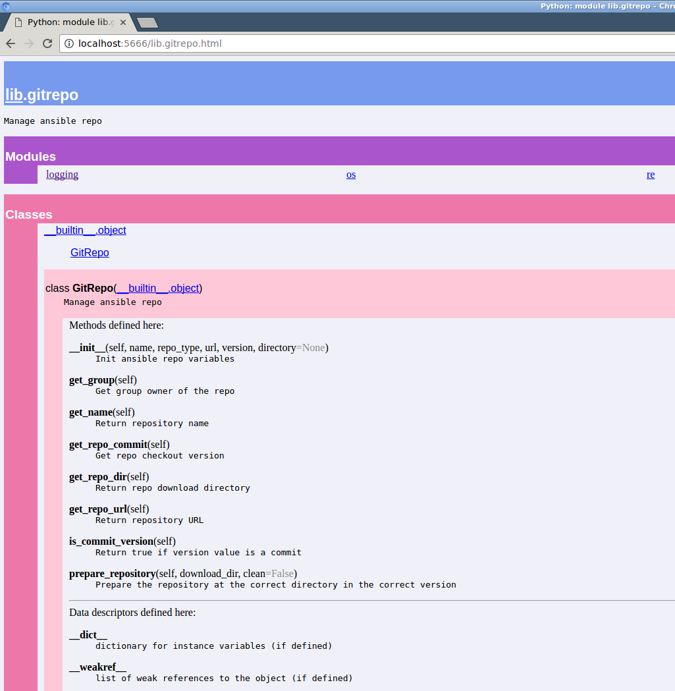
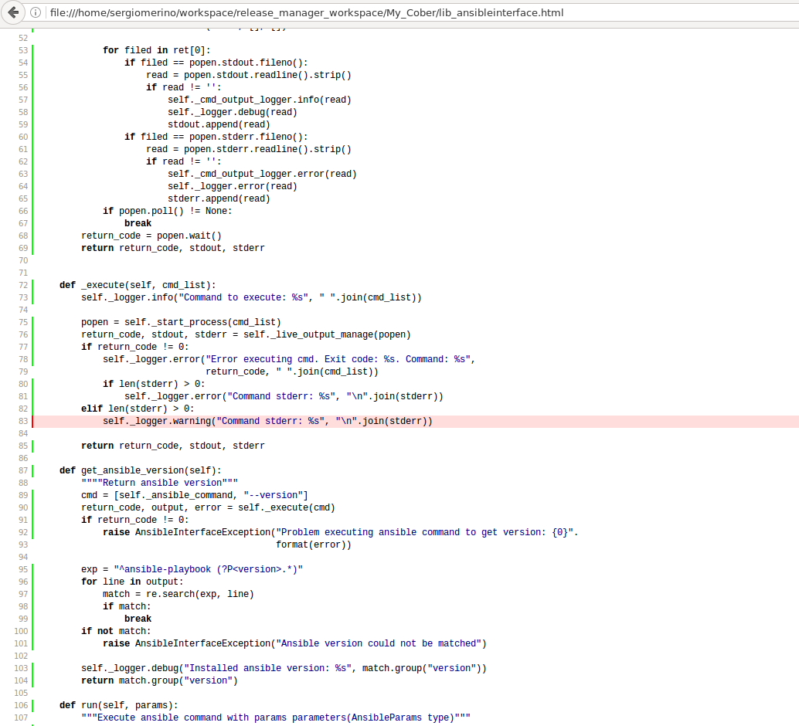

# Python best practices


<sup>Please note that Python is a trademark of the Python Software Foundation (PSF) and that the logo above is subject to use restrictions as described [here](https://www.python.org/psf/trademarks/).</sup>

The following contents table provides an index of the contents covered in this guide.

## Index

* [1. Introduction](#1-introduction)
* [2. The Zen of Python (Pep 20)](#2-the-zen-of-python-pep-20)
* [3. Python 2 vs Python 3](#3-python-2-vs-python-3)
* [4. Programming paradigms](#4-programming-paradigms)
* [5. Style guide (Pep 8)](#5-style-guide-pep-8)
* [6. Comments](#6-Comments)
* [7. Documentation](#7-Documentation)
* [8. Importing libraries](#8-importing-libraries)
* [9. Functions](#9-functions)
* [10. Standard library](#10-standard-library)
* [11. Logging](#11-logging)
* [12. String treatment](#12-string-treatment)
* [13. Operators](#13-operators)
* [14. Exceptions](#14-exceptions)
* [15. Input Output](#15-input-output)
* [16. Command line interface parameters](#16-command-line-interface-parameters)
* [17. Configuration files](#17-configuration-files)
* [18. Static code analysis](#18-static-code-analysis)
* [19. Testing](#19-testing)
* [20. Project structure](#20-project-structure)
* [21. Application packaging and distribution](#21-application-packaging-and-distribution)
* [22. Development Environments (IDEs)](#22-development-environments-ides)
* [23. Library and virtual environment management](#23-library-and-virtual-environment-management)
* [24. Future Improvments](#24-future-improvements)
* [25. References](#24-references)


### 1. Introduction

Python is a general purpose and high level programming language created by [Guido van Rossum](https://en.wikipedia.org/wiki/Guido_van_Rossum) in 1989. The first public release was made in 1991 (0.9.0) and it reached version 1.0 in 1994. As the time of this writing, Python 2.7.10 and Python 3.5.0 are considered as the stable versions.

The language allows the programmer to choose between different programming paradigms, although some are more supported than others:
* Procedural.
* Imperative.
* Object oriented.
* Functional.

Python is an __interpreted language__ as well. While files containing code have the .py extension, when executing the file it is partially compiled to a [bytecode](https://en.wikipedia.org/wiki/Bytecode) file with the .pyc extension. Hence, the .py file is only compiled for the first time (unless the code is changed) an then the .pyc file is executed upon every invocation. The bytecode is then translated to machine instructions by the Python Virtual Machine (PVM) during the execution. Since the bytecode needs to be interpreted by the PVM, Python's  performance is in general lower than the one provided by a compiled language.

As an interpreted language, an interactive console is provided as a tool that is part of the language. The console allows to easily ensure that the code that has been just developed performs as expected. As an example, the console supports defining functions and then testing them or loading whole modules just developed and using their inner objects or functions.

Python allows employing object oriented design, or procedural programming depending on the needs. And the fact that it is an interpreted language, has led to its use for scripting purposes.

Many libraries and frameworks have been created enriching the Pythons ecosystem and they are available for the developer to be used. These utilities focus on different areas such as scientific computing (SciPy), data analysis (pandas), or web development (Django) to name a few.

Because of all the characteristics previously presented, Python provides great programming flexibility and ease of development at the cost of performance. This facts have boosted the interest on it and its adoption for product development.

In this best practices guide, a set of recommendations is provided in order to take advantage of the all the possibilities the language provides and to avoid common mistakes that can arise in Python developments. Additionally, links to external references are provided as well when required.


### 2. The Zen of Python (Pep 20)

Unlike other languages, Python has a philosophy strongly associated to it, named as “The Zen of Python”. For example, the language itself is more restrictive in some aspects such as indenting and code organisation in comparison to other languages. However, by fixing the code style, programs become more uniform since all programmers follow the same rules and code readability is increased. Because of cases like the previous one, where a benefit is obtained, the community tries to reinforce the philosophy. Therefore, it is highly recommended to follow Python's philosophy when developing programs with it.

### 2.1. PEP overview

In Python, the development of the language itself has an specific procedure to follow, which is based on Python Enhancement Proposals or PEPs. These proposals, are published as an article that describes anything related to improving existing features, adding new features or describing ways of working. Each PEP is independently evolved until it is approved by the community in order to be applied from that moment onwards. All PEPs can be found in the following site:

https://www.python.org/dev/peps/

In these type processes and in the community in general, Guido acts as a Benevolent Dictator For Life (BDFL) by making certain type of decisions and ending discussions. That is, he acts as a recognised authority.

The recommended approach is to follow PEPs as possible, that is, when known and when they apply.

### 2.2. The Zen

The Zen of Python, which is the core of the philosophy in [PEP20](https://www.python.org/dev/peps/pep-0020/), whose content is represented below:

The Zen of Python:

    Beautiful is better than ugly.
    Explicit is better than implicit.
    Simple is better than complex.
    Complex is better than complicated.
    Flat is better than nested.
    Sparse is better than dense.
    Readability counts.
    Special cases aren't special enough to break the rules.
    Although practicality beats purity.
    Errors should never pass silently.
    Unless explicitly silenced.
    In the face of ambiguity, refuse the temptation to guess.
    There should be one-- and preferably only one --obvious way to do it.
    Although that way may not be obvious at first unless you're Dutch.
    Now is better than never.
    Although never is often better than *right* now.
    If the implementation is hard to explain, it's a bad idea.
    If the implementation is easy to explain, it may be a good idea.
    Namespaces are one honking great idea -- let's do more of those!


#### 2.2.1. The Zen through examples

Python's Zen can be followed through examples in the following link:

http://artifex.org/~hblanks/talks/2011/pep20_by_example.html

#### 2.2.2. Other philosophical implications

There are other areas where Python's philosophy affects development:

* Access to code: Since code is not compiled, and because of the way it is usually distributed (please see [21. Application packaging and distribution](#21-application-packaging-and-distribution)), code from libraries and frameworks is accessible to developers in general. However, it is possible to provide bytecode only packages that do not disclose the code.
* Documentation: The information of modules, classes and methods is available for developers to request while developing if it has been included in the code. This allows interactively requesting information on the method to be used while developing.
* Performance optimizations: In general, Python developments prefer to avoid spend much time in the code optimisation during the first development, this is due to the fact that optimizations may affect code readability or complexity. However, when performance is important it is recommended to optimize the code trying not to affect to the readability.

### 3. Python 2 vs Python 3

When people talk or write for what version they should use of Python, the typical response is this appointment: “Python 2.x is legacy, Python 3.x is the present and future of the language” [1]. For this reason Python 3 should be used in new projects, especially if the project will be long in time. Because Python 2.x won’t receive new improvements, it only has bug support and it will finish in 2020 [2].

The biggest disadvantage of Python 3 is the support from libraries, frameworks, packages… Because nowadays we have libraries which are only supported in Python 2.x, but this problem is fixing bit by bit. For this reason we only should use Python 2.x if our project requires a library that is only supported in Python 2.x. If the project will use Python 2.x, we should write the code thinking in the future port to Python 3.x. For this reason we can start writing code using the following:

* modules `__future__`
* Create class with inheritance from base class `Object`
* Using the new syntaxes, for example: `exceptions, prints, …`

To help us with this work, it’s possible use tools to help writing code to make a future port. For example the Pycharm IDE can be configured to check for compatibility. Of course nowadays exists tools to try to port code in Python 2.x to Python 3.x automatically, but they don’t always work correctly.

Main changes in Python 3.x respect to Python 2.x [1]:

* The best improvement is in Strings, now in Python 3.x The strings are unicode by default.
* Upgrade of bytes are formed unicodes.
* Improvement in packages for concurrence (Threads, locks, …).
* Change exceptions.
* Change print function.
* Change division.
* Change List Comprehension.
* And other changes, for example in improve readability.

### 4. Programming paradigms


#### 4.1 Structured

Python allow structured programming, in fact it is the most commonly paradigm used in python. Python allows to start coding without declaring any function but it is highly discouraged. Small scripts use to grow without any control or design, so it worth starting with functions. The most commonly starting sentences are this:
```python
if __name__ == '__main__':
    exit(main())
```

Also it recommended to use as much methods as possible, avoiding "allinone" programs, and as the program grows create different modules to maintain independence between functionalities. This helps to reuse code

### 4.2 Object Oriented

Python support object oriented programming. It worth the effort to design a solution with this paradigm. This paradigm force programmers to maintain modularity with a minimum level of cohesion and coupling.

```python
class MyClass(object):
    """My Class do this and this"""
    def __init__(self):
        """This is the contructor"""
        pass
```

#### 4.3 Functional

For functional programming Python provides lambda expressions, which allow to define functions in the same line we use them, and, to iterate over sequences, it provides list comprehensions and generators, both used over iterators.
Use them to apply functional coding style to your project.


##### 4.3.1 List comprehensions and generators

The main difference between both is that list comprehensions returns a list while generators returns an iterator whose
items are calculated when needed, so they are not in memory.

A list comprehension or generator expression is equivalent to the following Python code:

```python
for expr1 in sequence1:
    if not (condition1):
        continue   # Skip this element
    for expr2 in sequence2:
        if not (condition2):
            continue    # Skip this element
        ...
        for exprN in sequenceN:
             if not (conditionN):
                 continue   # Skip this element

             # Output the value of
             # the expression.
```

Make sure you use the functional way:
```python
[(expr1,expr2) for expr1 in sequence1 for expr2 in sequence2] # List comprehension

#or

((expr1,expr2) for expr1 in sequence1 for expr2 in sequence2) # Generator
```

###### 4.3.1.1 Yield

Any function containing a yield keyword is a generator function; this is detected by Python’s bytecode compiler which compiles the function specially as a result.

```python
def generate_ints(N):
    for i in range(N):
        yield i
```

So if we test it

```python
>>> gen = generate_ints(3)
>>> gen
<generator object generate_ints at ...>
>>> gen.next()
0
>>> gen.next()
1
>>> gen.next()
2
>>> gen.next()
Traceback (most recent call last):
  File "stdin", line 1, in ?
  File "stdin", line 2, in generate_ints
StopIteration
```


##### 4.3.2 Built-in functions

You can use map and filter (which duplicate list comprehensions features).

So having the upper function:
```python
def my_upper(s):
  return s.upper()
```
To apply that function to every item on a sequence,

instead of using the traditional for sentence:
```python
result_list = []
for elem in some_list:
  result_list.append(s.upper())
return result_list
```

You can simplify it with map:

```python
map(my_upper, ['bee', 'pythonist'])
> ['BEE', 'PYTHONIST']
```

Or even more with lambda expression, avoiding my_upper function declaration:

```python
map(lambda x: x.upper(), ['bee', 'pythonist'])
> ['BEE', 'PYTHONIST']
```

In the same way you can use filter to get only the items that fulfill some function logic.

```python
filter(lambda x: x>3 and x<6, [0,1,2,3,4,5,6])
> [4,5]
```

Furthermore the reduce built-in function performs the operation of applying some reducing logic by pairs.

```python
import operator

reduce(lambda x,y: ''.join([x,y]), ['B','EE','VA'])
> 'BEEVA'
```

### 5. Style guide (Pep 8)

This section is a summary of official PEP8 documentation, the examples are from this PEP8. For more information please visit to official PEP8 web site:

https://www.python.org/dev/peps/pep-0008/

#### 5.1. Indentation
Use 4 spaces per indentation level.

#### 5.2. Tabs or Spaces?

Spaces are the preferred indentation method.
Tabs should be used solely to remain consistent with code that is already indented with tabs.
As spaces and tabs are allowed python will fail if tabs and spaces are mixed at the same file.

#### 5.3. Maximum Line Length
Limit all lines to a maximum of 79 characters.

```python
with open('/path/to/some/file/you/want/to/read') as file_1, \
     open('/path/to/some/file/being/written', 'w') as file_2:
    file_2.write(file_1.read())
```

Make sure to indent the continued line appropriately. The preferred place to break around a binary operator is after the operator, not before it. Some examples:

```python
class Rectangle(Blob):

    def __init__(self, width, height,
                 color='black', emphasis=None, highlight=0):
        if (width == 0 and height == 0 and
                color == 'red' and emphasis == 'strong' or
                highlight > 100):
            raise ValueError("sorry, you lose")
        if width == 0 and height == 0 and (color == 'red' or
                                           emphasis is None):
            raise ValueError("I don't think so -- values are %s, %s" %
                             (width, height))
        Blob.__init__(self, width, height,
                      color, emphasis, highlight)
```

The maximum of 79 characters was decided when screens where shorter than current ones. Actually some projects decide to increase the number of characters to 99.

#### 5.4. Blank Lines
Surround top-level function and class definitions with two blank lines.
Method definitions inside a class are surrounded by a single blank line.
Extra blank lines may be used (sparingly) to separate groups of related functions. Blank lines may be omitted between a bunch of related one-liners (e.g. a set of dummy implementations).
Use blank lines in functions, sparingly, to indicate logical sections.
#### 5.5. Source File Encoding
Code in the core Python distribution should always use UTF-8 (or ASCII in Python 2).
Files using ASCII (in Python 2) or UTF-8 (in Python 3) should not have an encoding declaration.

#### 5.6. Imports
Imports should usually be on separate lines, e.g.:

Yes:
```python
import os
import sys
```

No:
```python
import sys, os
```
It's okay to say this though:
```python
from subprocess import Popen, PIPE
```
Imports are always put at the top of the file, just after any module comments and docstrings, and before module globals and constants.

Imports should be grouped in the following order:

standard library imports
related third party imports
local application/library specific imports
You should put a blank line between each group of imports.

#### 5.7. String Quotes
In Python, single-quoted strings and double-quoted strings are the same. This PEP does not make a recommendation for this. Pick a rule and stick to it. When a string contains single or double quote characters, however, use the other one to avoid backslashes in the string. It improves readability.

For triple-quoted strings, always use double quote characters to be consistent with the docstring convention in [PEP 257](https://www.python.org/dev/peps/pep-0257/) .

#### 5.8. Whitespace in Expressions and Statements

Avoid extraneous whitespace in the following situations:

Immediately inside parentheses, brackets or braces.

Yes:
```python
spam(ham[1], {eggs: 2})
```
No:  
```python
spam( ham[ 1 ], { eggs: 2 } )
```
Immediately before a comma, semicolon, or colon:

Yes:
```python
if x == 4: print x, y; x, y = y, x
```
No:  
```python
if x == 4 : print x , y ; x , y = y , x
```
However, in a slice the colon acts like a binary operator, and should have equal amounts on either side (treating it as the operator with the lowest priority). In an extended slice, both colons must have the same amount of spacing applied. Exception: when a slice parameter is omitted, the space is omitted.

Yes:
```python
ham[1:9], ham[1:9:3], ham[:9:3], ham[1::3], ham[1:9:]
ham[lower:upper], ham[lower:upper:], ham[lower::step]
ham[lower+offset : upper+offset]
ham[: upper_fn(x) : step_fn(x)], ham[:: step_fn(x)]
ham[lower + offset : upper + offset]
```
No:
```python
ham[lower + offset:upper + offset]
ham[1: 9], ham[1 :9], ham[1:9 :3]
ham[lower : : upper]
ham[ : upper]
```
Immediately before the open parenthesis that starts the argument list of a function call:

Yes:
```python
spam(1)
```
No:
```python
spam (1)
```
Immediately before the open parenthesis that starts an indexing or slicing:

Yes:
```python
dct['key'] = lst[index]
```
No:
```python
dct ['key'] = lst [index]
```
More than one space around an assignment (or other) operator to align it with another.

Yes:
```python
x = 1
y = 2
long_variable = 3
```
No:
```python
x             = 1
y             = 2
long_variable = 3
```

#### 5.9. Other Recommendations
Always surround these binary operators with a single space on either side: assignment ( = ), augmented assignment ( += , -= etc.), comparisons ( == , < , > , != , <> , <= , >= , in , not in , is , is not ), Booleans ( and , or , not ).

If operators with different priorities are used, consider adding whitespace around the operators with the lowest priority(ies). Use your own judgment; however, never use more than one space, and always have the same amount of whitespace on both sides of a binary operator.

Yes:
```python
i = i + 1
submitted += 1
x = x*2 - 1
hypot2 = x*x + y*y
c = (a+b) * (a-b)
```
No:
```python
i=i+1
submitted +=1
x = x * 2 - 1
hypot2 = x * x + y * y
c = (a + b) * (a - b)
```
Don't use spaces around the = sign when used to indicate a keyword argument or a default parameter value.

Yes:
```python
def complex(real, imag=0.0):
    return magic(r=real, i=imag)
 ```
No:
```python
def complex(real, imag = 0.0):
    return magic(r = real, i = imag)
```
Do use spaces around the = sign of an annotated function definition. Additionally, use a single space after the : , as well as a single space on either side of the -> sign representing an annotated return value.

Yes:
```python
def munge(input: AnyStr):
def munge(sep: AnyStr = None):
def munge() -> AnyStr:
def munge(input: AnyStr, sep: AnyStr = None, limit=1000):
```
No:
```python
def munge(input: AnyStr=None):
def munge(input:AnyStr):
def munge(input: AnyStr)->PosInt:
```
Compound statements (multiple statements on the same line) are generally discouraged.

Yes:
```python
if foo == 'blah':
    do_blah_thing()
do_one()
do_two()
do_three()
Rather not:

if foo == 'blah': do_blah_thing()
do_one(); do_two(); do_three()
```
While sometimes it's okay to put an if/for/while with a small body on the same line, never do this for multi-clause statements. Also avoid folding such long lines!

Rather not:
```python
if foo == 'blah': do_blah_thing()
for x in lst: total += x
while t < 10: t = delay()
```
Definitely not:
```python
if foo == 'blah': do_blah_thing()
else: do_non_blah_thing()

try: something()
finally: cleanup()

do_one(); do_two(); do_three(long, argument,
                             list, like, this)

if foo == 'blah': one(); two(); three()
```

#### 5.10 Comments

Write your comments in English.

#### 5.10.1 Block Comments
Block comments generally apply to some (or all) code that follows them, and are indented to the same level as that code. Each line of a block comment starts with a # and a single space (unless it is indented text inside the comment).

Paragraphs inside a block comment are separated by a line containing a single # .

#### 5.10.2 Inline Comments
Use inline comments sparingly.

An inline comment is a comment on the same line as a statement. Inline comments should be separated by at least two spaces from the statement. They should start with a # and a single space.

Inline comments should be used only when really needed (with useful information), so try to avoid comments similar to:
```python
x = x + 1                 # Increment x
```

#### 5.10.3 Documentation Strings

Conventions for writing good documentation strings (a.k.a. "docstrings") is specified in [PEP 257](https://www.python.org/dev/peps/pep-0257/
.0) .

It is recommended to write docstrings for all public modules, functions, classes, and methods but they are not necessary for non-public methods, you should have a comment that describes what the method does instead (this comment should appear after the def line).

Note one important thing regarding the """ that ends a multiline docstring, and it should be on a line by itself, e.g.:

"""Return a foobang

Optional plotz says to frobnicate the bizbaz first.
"""
For one liner docstrings, please keep the closing """ on the same line.

### 5.11 Version Bookkeeping

If you have to have Subversion, CVS, or RCS crud in your source file, do it as follows.

__version__ = "$Revision$"
These lines should be included after the module's docstring, before any other code, separated by a blank line above and below.

### 5.12 Naming Conventions

This part is specified in [PEP 423](https://www.python.org/dev/peps/pep-0423/).

#### 5.12.1 Overriding Principle

Names that are visible to the user as public parts of the API should follow conventions that reflect usage rather than implementation.

#### 5.12.2 Descriptive: Naming Styles

There are a lot of different naming styles. It helps to be able to recognize what naming style is being used, independently from what they are used for.

The following naming styles are commonly distinguished:

 - b (single lowercase letter)
 - B (single uppercase letter)
 - lowercase
 - lower_case_with_underscores

 - UPPERCASE

 - UPPER_CASE_WITH_UNDERSCORES

 - CapitalizedWords (or CapWords, or CamelCase -- so named because of the bumpy look of its letters [3] ). This is also sometimes known as StudlyCaps.

Note: When using abbreviations in CapWords, capitalize all the letters of the abbreviation. Thus HTTPServerError is better than HttpServerError.

  - mixedCase (differs from CapitalizedWords by initial lowercase character!)

  - Capitalized_Words_With_Underscores (ugly!)

There's also the style of using a short unique prefix to group related names together. This is not used much in Python, but it is mentioned for completeness. For example, the os.stat() function returns a tuple whose items traditionally have names like st_mode , st_size , st_mtime and so on. (This is done to emphasize the correspondence with the fields of the POSIX system call struct, which helps programmers familiar with that.)

The X11 library uses a leading X for all its public functions. In Python, this style is generally deemed unnecessary because attribute and method names are prefixed with an object, and function names are prefixed with a module name.

In addition, the following special forms using leading or trailing underscores are recognized (these can generally be combined with any case convention):

_single_leading_underscore : weak "internal use" indicator. E.g. from M import * does not import objects whose name starts with an underscore.

single_trailing_underscore_ : used by convention to avoid conflicts with Python keyword, e.g.

Tkinter.Toplevel(master, class_='ClassName')
__double_leading_underscore : when naming a class attribute, invokes name mangling (inside class FooBar, __boo becomes _FooBar__boo ; see below).

__double_leading_and_trailing_underscore__ : "magic" objects or attributes that live in user-controlled namespaces. E.g. __init__ , __import__ or __file__ . Never invent such names; only use them as documented.

#### 5.12.3 Prescriptive: Naming Conventions

##### 5.12.3.1 Names to Avoid

Never use the characters 'l' (lowercase letter el), 'O' (uppercase letter oh), or 'I' (uppercase letter eye) as single character variable names.

In some fonts, these characters are indistinguishable from the numerals one and zero. When tempted to use 'l', use 'L' instead.

##### 5.12.3.2 Package and Module Names

Modules should have short, all-lowercase names. Underscores can be used in the module name if it improves readability. Python packages should also have short, all-lowercase names, although the use of underscores is discouraged.

When an extension module written in C or C++ has an accompanying Python module that provides a higher level (e.g. more object oriented) interface, the C/C++ module has a leading underscore (e.g. _socket ).

##### 5.12.3.3 Class Names
Class names should normally use the CapWords convention.

The naming convention for functions may be used instead in cases where the interface is documented and used primarily as a callable.

Note that there is a separate convention for builtin names: most builtin names are single words (or two words run together), with the CapWords convention used only for exception names and builtin constants.

##### 5.12.3.4 Exception Names
Because exceptions should be classes, the class naming convention applies here. However, you should use the suffix "Error" on your exception names (if the exception actually is an error).

##### 5.12.3.5 Global Variable Names
(Let's hope that these variables are meant for use inside one module only.) The conventions are about the same as those for functions.

Modules that are designed for use via from M import * should use the __all__ mechanism to prevent exporting globals, or use the older convention of prefixing such globals with an underscore (which you might want to do to indicate these globals are "module non-public").

##### 5.12.3.6 Function Names
Function names should be lowercase, with words separated by underscores as necessary to improve readability.

mixedCase is allowed only in contexts where that's already the prevailing style (e.g. threading.py), to retain backwards compatibility.

##### 5.12.3.7 Function and method arguments
Always use self for the first argument to instance methods.

Always use cls for the first argument to class methods.

If a function argument's name clashes with a reserved keyword, it is generally better to append a single trailing underscore rather than use an abbreviation or spelling corruption. Thus class_ is better than cls . (Perhaps better is to avoid such clashes by using a synonym.)

##### 5.12.3.8 Method Names and Instance Variables
Use the function naming rules: lowercase with words separated by underscores as necessary to improve readability.

Use one leading underscore only for non-public methods and instance variables.

To avoid name clashes with subclasses, use two leading underscores to invoke Python's name mangling rules.

Python mangles these names with the class name: if class Foo has an attribute named __a , it cannot be accessed by Foo.__a . (An insistent user could still gain access by calling Foo._Foo__a .) Generally, double leading underscores should be used only to avoid name conflicts with attributes in classes designed to be subclassed.

Note: there is some controversy about the use of __names (see below).

##### 5.12.3.9 Constants
Constants are usually defined on a module level and written in all capital letters with underscores separating words. Examples include MAX_OVERFLOW and TOTAL .


### 6. Comments

#### 6.1 Code Documentation

Comments clarify the code and they are added with purpose of making the code easier to understand. In Python, comments begin with a hash (number sign) (#).

#### 6.2 Block comments

Each line of a block comment starts with a # and a single space.
Paragraphs inside a block comment are separated by a line containing a single #.

#### 6.3 Avoid comments

The main reason to avoid comments is because code use to be updated frequently but not the comments, so the comments become deprecated and not commented is worse than wrong comments. To compensate the absence of comments programmers must create understandable code using descriptive variables, functions and classes names and simple methods. With that and the docstring must be enough in most of cases.

[PEP8-comments](https://www.python.org/dev/peps/pep-0008/#comments)

### 7. Documentation

#### 7.1 Docstrings

A docstring is a string literal that occurs as the first statement in a module, function, class, or method definition.

[PEP257-docstring Conventions](https://www.python.org/dev/peps/pep-0008/#comments)

Write docstrings for all public modules, functions, classes, and methods. Docstrings are not necessary for non-public methods, but you should have a comment that describes what the method does.

In Python, docstrings describe modules, classes, and functions, this comment should appear after the def line.

```python
def my_function(x):
    """My documentation string."""
    ...
```
#### 7.2 Docstring for public APIs

When we are working on public APIs we must be more accurate with our methods documentation, specially in python because we don't define types the methods definition. With this idea in mind we must describe not only the function but also the input parameters and the output:

```python
def complex(real=0.0, imag=0.0):
    """Form a complex number.
    Keyword arguments:
    real -- the real part (default 0.0)
    imag -- the imaginary part (default 0.0)
    """
```

#### 7.3 Generate documentation

If we have added docstrings to our python code we are able to generate automatically the documentation for the code. To do that we have some different programs. One of the is the pydoc. This is an example of how to use it generating html files with the documentation:

```shell
pydoc -w my_program.py
```

Also pydoc allow us to create a webserver in which we could browse and the documentation is generated dynamically as we browse:

```shell
pydoc -p 9999
```
Then we access to http://localhost:9999 from any browse and we have a site like this:



### 8. Importing libraries

The best practice is to just import what you need. 
So, you do not use ___import *___ if you do not want to hear about the lint.

Instead, import exactly the modules you really need.

```python
from datetime import date
```

#### 8.1 Libraries path

Every time an import is done python look for the libraries at some predefined paths. The paths are checked one by one until the library is found. So if a library is repeated or there are two libraries with the same name it will import the first found. This paths can be shown using this command:
```shell
python -c "import sys; print sys.path"
```
This paths could be changes inside python script during runtime or before executing it using environment variable PYTHONPATH

#### 8.2 Creating a library
Create a library is as simple al leaving the library file on a python path directory or in the path where the binary is being executed. For example
```
|- my_program.py
|- module1.py
```

Being my_program.py:
```python
import module1
```
This case was very simple but usually we want to include at a library more than one module or class. In this case we need to create an empty file named __init__.py at the directory:

```
|- my_program.py
|- lib
   |- __init__.py
   |- module1.py
```

In this case, the content of my_program.py will be this:

```python
import lib.module1
```

### 9. Functions

Functions in Python can be used as part of a script and as part of modules, in a similar fashion as methods of a class as well. In this section their use and possibilities are covered as well as the recommended practices with functions.

#### 9.1. General use of functions

In this section the general properties of functions are covered.

As a quick introduction, the syntax for defining a function in Python is the following one:

```python
def <functionname>(arg1, arg2,... argN):
    <statements>
    <statements>
```

An example of a simple function would be:

```python
def hello():
    print 'hi there!'
```

While the call to that very same function it is performed as:

```python
hello()
hi there!
```

Functions may or may not have a return statement. Please take into account that when no return statement is defined a None object is returned underneath in order to avoid errors.

##### 9.1.1. Functions as objects

The first thing to take into account in Python in relation to functions is that they are just another type of object. Hence, it is possible to pass a function's object reference to another function in order to perform operations with it.

The following code shows how to obtain the hello function's object reference:

```python
>>> hello
<function hello at 0x7f2cd3a25668>
>>> myref = hello
>>> myref
<function hello at 0x7f2cd3a25668>
```

For example it is possible to define the following function, which computes an operation on a list based on a function passed to it:

```python
>>> list = [1,2,4,5,7,8]
>>> list
[1, 2, 4, 5, 7, 8]
>>> def plusone(myelem):
...     return myelem + 1
...
>>> def bytwo(myelem):
...     return myelem * 2

>>> def complexfunc(list, func):
...     newlist = []
...     for x in list:
...         newlist.append(func(x))
...     return newlist
...
>>> complexfunc(list, plusone)
[2, 3, 5, 6, 8, 9]
>>> complexfunc(list, bytwo)
[2, 4, 8, 10, 14, 16]
```

This approach allows developing functions or frameworks that provide a greater level of abstraction and power. However, the added complexity should be backed up by a relevant need.

##### 9.1.2. Function polymorphism

In Python, objects of different types can have the same type of interfaces or protocols implemented, while the operation performed is understood in a different way. For example, the + operation can be applied both to strings and to numbers with a different interpretation, concatenation in the first case and addition in the second:

```python
>>> 'spam' + 'eggs'
'spameggs'

>>> 5 + 4
9
```

And therefore, a function that does not force its parameters to be of a fixed type, it is a polymorphic function. As it can be seen in the following example, the plus function can operate on different object types:

```python
>>> def plus(one, two):
...     return one + two
...
>>> plus('spam', 'eggs')
'spameggs'
>>> plus(5, 4)
9
```

In general, functions developed in Python should take advantage of this property since they become more generic and can be reused in the future without having to worry about the type of objects they receive as parameters. In this way, a function will be able to operate on object types that do not even exist yet. In case one of the objects processed by the function does not support the interfaces or protocols that are required by the function, the function will raise an error to indicate the case.

##### 9.1.3. Scopes

In Python, there are different scopes that a variable name can be under. These are the four possible scopes:

* Python built-in scope.
* Global scope: File scope or module namespace.
* Enclosing function scope: Superior functions to the current one, when function nesting is used.
* Local function scope: The scope of the current function.

Python starts the search from the local scope until the built-in one. This is why some errors do not appear until certain executions of the file, when the function with the error is executed.

As a general rule, it is recommended to minimize global variables in modules, since that makes code difficult to understand and error prone. This is because multiple functions may interact with the same object or variable and it is difficult to follow the evolution of the state of such object.

More importantly, cross file variable modifications should be avoided as well. This is the case when an object within a file is modified by a function within another module or file. Hence, beyond the previous drawback a dependency between files is introduced.

#### 9.2. Lambda functions

The Lambda expression, allows defining and applying an inline function (functions contained in a single line), and they are usually used within another function call. The same line therefore is a function definition and function call.

For example, in the case of the previous complexfunc, instead of passing an existing function, lambda can be used to define one for it:

```python
# Multiply by 2 instead of passing the by two function reference:
>>> complexfunc(list, (lambda x: x * 2))
[2, 4, 8, 10, 14, 16]
# Identify odd and even numbers:
>>> complexfunc(list, (lambda x: x % 2 == 0))
[False, True, True, False, False, True]
```

As it can be noticed, the function passed to complexfunc is no longer defined one or several lines separated from the call. This allows understanding the call to complexfunc just when read, because no other function's definition needs to be looked for.

As another example, the Spark data processing engine allows developing against its API through Python with pyspark. Spark creates datasets (RDDs) by transforming and or combining other datasets, and requires the developer to pass a function to perform the conversion. Within the same code line it is possible to define the function and to call it as it can bee seen below:

```python
newrdd = inputrdd.filter(lambda x: x if (x.get('postalcode') != 'SW1A0AA') else None)
```

The use of lambda functions is recommended since it allows reducing the amount of functions that is used in the code and it improves code readability. However, the use should be done in cases where such function is simple and it is seldomly used for the same operation. In case the previous requirements are not met, a regular function should be created.


#### 9.3. Decorators

In Python, decorators are a way of transforming functions or methods. Before their introduction, these operations where performed after the definition itself, which separated these two parts of the functions characteristics, being the effect more notable in the case of large functions or methods:

```python
def foo(cls):
    pass
foo = synchronized(lock)(foo)
foo = classmethod(foo)
```

In order to keep all the declaration related parts together, the @ symbol is used prior to the function declaration in order to perform these same operations:

```python
@classmethod
@synchronized(lock)
def foo(cls):
    pass
```

Decorators and their motivations are described in [PEP 318](https://www.python.org/dev/peps/pep-0318/), where all the related information can be found. For Python 3, class decorators are also available as described in [PEP 3129](https://www.python.org/dev/peps/pep-3129/).

In general, the use of decorators is recommended in order to improve code readability.


### 10. Standard library

The Python Standard Library contains a huge number of very useful modules. It is important that you become familiar with the Python Standard Library since most of your problems can be solved more easily and quickly if you are familiar with this library of modules.

[Documentation for the standard library](//docs.python.org/library/)

[Referencia de la Biblioteca de Python](http://pyspanishdoc.sourceforge.net/lib/lib.html)

Some examples of modules:

Sys module, os module, time module, math module and  string module.

#### 10.1 The sys module

The sys module contains system-specific functionality.

Example:

```python
...
if len(sys.argv) < 2:
    print 'No action specified.'
    sys.exit()

if sys.argv[1].startswith('--'):
    option = sys.argv[1][2:]

    if option == 'version':
        print 'Version 1.00'
    elif option == 'help':
        print '''\
...
```
#### 10.2 Os module

This module represents operating system specific functionality. This module is especially important if you want to develop your programs platform-independent i.e. it should run on Linux as well as Windows without any problems and without requiring changes.

Example: To get the complete path of the current working directory enter.

```python
import os
os.getcwd()
```

#### 10.3 Time module

The time module exposes C library functions for manipulating dates and times.

Example:

```python
import time

print 'gmtime   :', time.gmtime()
print 'localtime:', time.localtime()
print 'mktime   :', time.mktime(time.localtime())

t = time.localtime()
print 'Day of month:', t.tm_mday
print ' Day of week:', t.tm_wday
print ' Day of year:', t.tm_yday
```

#### 10.4 Math module

The math module implements many of the IEEE functions that would normally be found in the native platform C libraries for complex mathematical operations using floating point values, including logarithms and trigonometric operations.

```python
import math

print 'π: %.30f' % math.pi
print 'e: %.30f' % math.e
```

#### 10.5 String module

The string module contains a number of useful constants and classes.

Example:

```python
import string

s = 'The quick brown fox jumped over the lazy dog.'

print s
print string.capwords(s)
```
### 11. Logging

Use logging config files instead of code-logging to avoid make changes into your code every time you want to change some aspect of your logging, whenever your project allows it.
In addition, config files allow to change in runtime your logging configuration whether you use:

```python
logging.config.listen()
```


### 12. String treatment

Python has a built-in class named ***str*** which substitutes older ***string*** module.
This class allows us to perform many operations on the right way.

There are three ways to enclose strings in python.
You can either use double or single quote, and each of them can contain the other one.
To span an string literal into multiple lines, you can use the backslash at the end of each line, or use triple quoted strings which allows multiple lines of text.

Python strings are ***immutable*** so they can not be changed after they are created.
Characters in strings literals can be accessed using the standard [] syntax using zero-based indexing. Furthermore, you can use ***slice*** syntax to refer to sub-parts of sequences

Python includes the ***%*** operator that allows to fill strings with variables in the same way we do it with printf C function.

Although regular Python strings are just plain bytes, it manages i18n within its strings by using ***unicode***.

#### 12.1 str methods

Here are some of the most common string methods.
It is recommended to use them because of performance reasons:

    s.lower(), s.upper() -- returns the lowercase or uppercase version of the string

    s.strip() -- returns a string with whitespace removed from the start and end

    s.isalpha()/s.isdigit()/s.isspace()... -- tests if all the string chars are in the various character classes

    s.startswith('other'), s.endswith('other') -- tests if the string starts or ends with the given other string

    s.find('other') -- searches for the given other string (not a regular expression) within s, and returns the first index where it begins or -1 if not found

    s.replace('old', 'new') -- returns a string where all occurrences of 'old' have been replaced by 'new'

    s.split('delim') -- returns a list of substrings separated by the given delimiter. The delimiter is not a regular expression, it's just text. 'aaa,bbb,ccc'.split(',') -> ['aaa', 'bbb', 'ccc']. As a convenient special case s.split() (with no arguments) splits on all whitespace chars.

    s.join(list) -- opposite of split(), joins the elements in the given list together using the string as the delimiter. e.g. '---'.join(['aaa', 'bbb', 'ccc']) -> aaa---bbb---ccc


Python does not have a separate character type. Instead an expression like s[8] returns a string-length-1 containing the character. With that string-length-1, the operators ==, <=, ... all work as you would expect, so mostly you don't need to know that Python does not have a separate scalar "char" type.

#### 12.2 Single, double and triple quoted strings

Use single quoted literals for strings that relate to the functionality of the code itself (eg. dict keys, regular expressions, SQL).

```python
regular_expression = r'([A-Z])\w+'
my_dict['key'] = 'something'
```

On the other hand, use double quoted literals for strings that might eventually be visible to the user (whether or not they need translation)

```python
print("This is what you're gonna read")
```

Finally, use triple quoted strings for documentation or long strings with multiple lines.

```python
def cool_method(arg):
  """ This is the cool method docstring """ # Docstring
  raw = """
    {
      'key': 'something'
      'another_key':{
        'the_key': 'value'
      }
    }
    """
  return ''.join([raw,arg])

```


#### 12.3 Slice syntax

Python has a printf()-like facility to put together a string. The % operator takes a printf-type format string on the left (%d int, %s string, %f/%g floating point), and the matching values in a tuple on the right (a tuple is made of values separated by commas, typically grouped inside parenthesis):

```python

  text = "%d little pigs come out or I'll %s and %s and %s" % (3, 'huff', 'puff', 'blow down')

```

The above line is kind of long -- suppose you want to break it into separate lines. You cannot just split the line after the '%' as you might in other languages, since by default Python treats each line as a separate statement (on the plus side, this is why we don't need to type semi-colons on each line). To fix this, enclose the whole expression in an outer set of parenthesis -- then the expression is allowed to span multiple lines. This code-across-lines technique works with the various grouping constructs detailed below: ( ), [ ], { }.

```python
# add parens to make the long-line work:
    text = ("%d little pigs come out or I'll %s and %s and %s" %
      (3, 'huff', 'puff', 'blow down'))
```

#### 12.4 Unicode

Regular Python strings are *not* unicode, they are just plain bytes. To create an unicode string, use the 'u' prefix on the string literal:

```python
> ustring = u'A unicode \u018e string \xf1'
> ustring
u'A unicode \u018e string \xf1'
```

A unicode string is a different type of object from regular "str" string, but the unicode string is compatible (they share the common superclass "basestring"), and the various libraries such as regular expressions work correctly if passed a unicode string instead of a regular string.

To convert a unicode string to bytes with an encoding such as 'utf-8', call the ustring.encode('utf-8') method on the unicode string. Going the other direction, the unicode(s, encoding) function converts encoded plain bytes to a unicode string:

```python
## (ustring from above contains a unicode string)
> s = ustring.encode('utf-8')
> s
'A unicode \xc6\x8e string \xc3\xb1'  ## bytes of utf-8 encoding
> t = unicode(s, 'utf-8')             ## Convert bytes back to a unicode string
> t == ustring                      ## It's the same as the original
True
```
The built-in print does not work fully with unicode strings. You can encode() first to print in utf-8 or whatever.

### 13. Operators
This section explains the basics of operators in Python.

#### 13.1. Assignment
The assignment in python is made with **=**. It is important to know that the assignment for basic types in python is made by value, but for complex types is made by reference. For example:

Basic type:
```python
>>> a = 1
>>> b = a
>>> b
1
>>> a += 1
>>> a
2
>>> b
1
```
Complex type:

```python
>>> a = [1]
>>> b = a
>>> b
[1]
>>> a.append(2)
>>> a
[1, 2]
>>> b
[1, 2]
```

#### 13.2. Arithmetic operators

Python have the basic arithmetic operators like other languages: **+**, **-**, **/**, __*__, **+=**, **-=** ...

#### 13.3.Logic operators

Python have the basic logic operators like other languages: **==**, **not**, **is**, **in**, **and**, **or** ...

You should know the difference between **==** and **is**.
* **is** compare objects by reference, i.e. if two objects point to same object, it will return True.
* **==** compare if two objects are equal.

Other advise: when comparing an object with **True**, **False** or **None**, the comparison must be done with the **is** operator and not with **==**.

The operators **and**, **or** are short-circuiting.

#### 13.4. Conditions

The statement for conditions in python is the following:

```python
if condition:
  # things
elif condition:
  # things
else:
  # things
```

Good practice statement **if**

NO

```python
if condition: function()
```

Yes

```python
if condition:
  function()
```

No
```python
if var is True:
  ...
```

Yes
```python
if var:
  ...
```

No

``` python
if var is None:
  ...
```

Yes
```python
if not var:
  ...
```

Python doesn't have switch statement, because it is not readable. It is replaced by elif statement, but if the **if** will be long, it is not considered a good practice. Because it is not readable and it is inefficient. It is possible use a **dict** to do it. For example:

* If it is necessary to return a single value, do this:

```python
value = 2
switch_value = {1: 'one', 2: 'two', 3: 'three'}
name_value = switch_value[value]
```

* If you need a more complex process, it can be done with a dict whose values are functions:

```python
value = '3'
switch_value = {'1': _function_one, '2': _function_two, '3': _function_three}
value_return = switch_value[value]()

def _function_one():
  # things
def _function_two():
  # things  
def _function_three():
  # things  
```

#### 13.5. Loops
Python has the **for** and **while** loops like other languages. If you want to iterate a dictionary or a list use the statement **for**, it has a implicit iterator. Example:

```python
>>> my_list = [1,2,3,4]
>>> for ele in my_list:
...  print(ele)
1
2
3
4
```

To do a loops for x length use statement **for** with function **range** in Python 3 or **xrange** in Python 2. Don't use function **range** in python 2, because it is inefficient compared to **xrange**. Example:

```python
>>>for i in range(5):
...  print i
0
1
2
3
4
```


### 14. Exceptions

Python handles all errors with exceptions.

An exception is a signal that an error has occurred. There are a number of built-in exceptions for example dividing by zero. You can also define your own exceptions creating a class that inherits from Exception.


#### 14.1. Catching exceptions

In order to handle errors, you can set up exception handling blocks in your code. The keywords try and except are used to catch exceptions. When an error occurs within the try block, Python looks for a matching except block to handle it. If there is one, execution jumps there.


```python
try:
    print 5/0
except ZeroDivisionError:
    print "My error message"
```


If you don't specify an exception type on the except line, it will cheerfully catch all exceptions. This is generally a bad idea in production code, since it means your program will blissfully ignore unexpected errors as well as ones which the except block is actually prepared to handle.


```python
def function1(param):
    return function2(param) + 1

def function2(param):
    if param < 0: raise ValueError, "My error message"
    else: return "ok"

try:
    print function1(-100)
except ValueError:
    print "My error message"
```


#### 14.2. Custom Exceptions

```python
 class MyCustomException(Exception):
    def __init__(self, value):
        self.parameter = value
    def __str__(self):
        return repr(self.parameter)
```

Using that exception:

```python
try:
    raise MyCustomException("My error message")
except MyCustomException, (instance):
    print "Caught: " + instance.parameter
```


#### 14.3 Recovering and continuing with finally


Finally clause allows programmers to close such resources in case of an exception.


```python
try:
    result = x / y
except ZeroDivisionError:
    print "division by zero!"
else:
    print "result is", result
finally:
    print "executing finally clause"
```

#### 14.4 Built-in Exceptions

The exceptions are defined in the module exceptions. This module does not needs to be imported: the exceptions are provided in the built-in namespace as well as the exceptions module.

[Built-in Exceptions](https://docs.python.org/2/library/exceptions.html)


### 15. Input Output
In this chapter, the basics of input and output in Python will be explained. If the programmer needs more advanced tips, go to the official documentation.

#### 15.1 Print
Like others programming languages, Python have a function for print the result in console. This function is easy to use, it is only necessary to call the function with a string and it will be writen in the console. The programmer needs to remember that this function has changed in Python 3 with respect to Python 2. For this reason it is advisable to use this function always with parenthesis, because this is mandatory in Python 3 while it is optional in Python 2. Examples below:  

```python
>>>print(“Hello world”)
Hello world
>>>s = “String with things”
>>print(s)
String with things
>>>print(10)
10
```

On the other hand, if the programer wants to print big Python objects, it has a special module to print them in a beautiful way. The name of the module is pprint. It is necessary import it before use. Example of usage:

```python
>>>from pprint import pprint
>>>a={1:['1111111111111111','2','33333333333333333333333'],3:'444444444444444444444444444444444444',5:{1:'333333333333333333333333333333333333333333333'}}
>>>pprint(a)
{1: ['1111111111111111', '2', '33333333333333333333333'],
 3: '444444444444444444444444444444444444',
 5: {1: '333333333333333333333333333333333333333333333'}}
>>>print(a)
{1: ['1111111111111111', '2', '33333333333333333333333'], 3: '444444444444444444444444444444444444', 5: {1: '333333333333333333333333333333333333333333333'}}
```

#### 15.2 Input

Python have a function to read from console inputs and it can be used to interact with the user. The name of the function is raw_input() in Python 2 and input() in Python 3. This function will read lines until the user press enter and it will transform the lines to string.
Example:

```python
>>>age = raw_input("Tell your age\n")
Tell your age
35
>>>age
'35'
```

#### 15.3 Files

This chapter is to explain how the files work in Python.

##### 15.3.1 Open
To work with files is necessary open them before using them. This is done with the following line:

```python
file = open(filename, mode)
```

When opening a file, it is necessary say the mode. In Python there exist these modes:

* 'r' → read only, the default mode. But it is a good practice to write it.
* 'w' → write only, if the file exists, it will be erased.
* 'a' → when writing it appends the content at the end of the file.
* '+r' → read and write.

But open with the last code is a bad practice. Because it doesn't ensure that the file will be closed. For this reason use the following code:

```python
with open(filename, mode) as f:
    #use the file read, write ...
```

With this code if you don't close the file, it will raise a exception.

##### 15.3.2 Read

To read a file in python there exists several methods:

* file.read(size): Read all file or the size indicate. This size is optional. When the end of the file has been reached it returns an empty string ("").
* file.readline(): Read a single line. It stops when find a \n. When the end of the file has been reached it returns an empty string ("").
* To save all lines in a list, it is possible used this list(f) or file.readlines()

##### 15.3.3

To write, it is only necessary to call this function:

```python
file.write(“some thing”)
```

The writer function only accepts Strings.

##### 15.3.4
When finished the use of the file, the programmer must close it to unlock the resource:

```python
file.close()
```

### 16. Command line interface parameters
For input parameters parse it is recommended to user a library that allows as an easy parsing with minimum effort. There are some libraries to do this but argparse is recommended.
#### 16.1 argparse
Argparse is recommended because it provides us diferente number of tools and parsing options:
* Include help for each parameter
* Define parameters type
* Define default parameters
* Define if a parameter is or not required
* Define possible values of a parameter
* Add more than one value to a parameter
* Add automatic actions to the parameters

#### 16.2 Examples

```python
parser = argparse.ArgumentParser(description='Program description')
parser.add_argument('-f','--foo', help='Argument description', required=True)
parser.add_argument("-o", "--outputdir", type=str,
                    help="Workspace to download the repositories",
                    default=os.path.join(os.getcwd(), "download_dir"), required=False)
parser.add_argument("-e", "--environment", required=True, type=str,
                    choices=["pro", "pre", "lab", "tec"], help="Environment")
parser.add_argument("-a", "--execution-list", type=str, required=False, nargs="+",
                    help="Overwrite the execution list from release file")
                    args = vars(parser.parse_args())
parser.add_argument("-v", "--verbose", action="store_true", default=False,
                        help="Ansible verbose"
```
[Argparse](https://docs.python.org/2/howto/argparse.html)


### 17. Configuration files

Use the ConfigParser module to manage user-editable configuration files for an application. The configuration files are organized into sections, and each section can contain name-value pairs for configuration data.

The file format used by ConfigParser consists of one or more named sections, each of which can contain individual options with names and values.

Options are listed one per line within a section. The line starts with the name of the option, which is separated from the value by a colon (:) or equal sign (=). Whitespace around the separator is ignored when the file is parsed.


```python
[seccion_A]
username = miguel
password = miguel_secret
```

Reading Configuration Files

```python
from ConfigParser import SafeConfigParser

parser = SafeConfigParser()
parser.read('simple.ini')

print parser.get('seccion_A', 'username')
```

Modifying Settings

While SafeConfigParser is primarily intended to be configured by reading settings from files, settings can also be populated by calling add_section() to create a new section, and set() to add or change an option.

```python
import ConfigParser

parser = ConfigParser.SafeConfigParser()

parser.add_section('seccion_A')
parser.set('seccion_A', 'username', 'miguel')
parser.set('seccion_A', 'password', 'miguel_secret')

for section in parser.sections():
    print section
    for name, value in parser.items(section):
        print '  %s = %r' % (name, value)
```


Sections and options can be removed from a SafeConfigParser with remove_section() and remove_option()

```python
from ConfigParser import SafeConfigParser

parser = SafeConfigParser()
parser.read('multisection.ini')

print 'Read values:\n'
for section in parser.sections():
    print section
    for name, value in parser.items(section):
        ...

parser.remove_option('section_A', 'password')
parser.remove_section('section_B')

```


Saving Configuration Files

```python
import ConfigParser
import sys

parser = ConfigParser.SafeConfigParser()

parser.add_section('section_A')
parser.set('section_A', 'name', 'Miguel')

parser.write(sys.stdout)
```

#### 17.2 YAML

YAML is a configuration file format

[Pyyaml documentation](http://pyyaml.org/wiki/PyYAMLDocumentation)

Config file example in YAML format
```python
mysql:
    host: localhost
    user: root
    passwd: my secret password
    db: write-math
other:
    preprocessing_queue:
        - preprocessing.scale_and_center
        - preprocessing.dot_reduction
        - preprocessing.connect_lines
    use_anonymous: yes
```

Example of use

```python
import yaml

with open("config.yml", 'r') as ymlfile:
    cfg = yaml.load(ymlfile)

for section in cfg:
    print(section)
print(cfg['mysql'])
print(cfg['other'])
It outputs:

other
mysql
{'passwd': 'my secret password',
 'host': 'localhost',
 'db': 'write-math',
 'user': 'root'}
{'preprocessing_queue': ['preprocessing.scale_and_center',
                         'preprocessing.dot_reduction',
                         'preprocessing.connect_lines'],
 'use_anonymous': True}
```

### 18. Static code analysis
The static analysis helps us to analyse some errors without needing to run the program. With this type of tools we can detect some coding errors like style guide rules, good practices, unused variables, syntax errors... What this tools will never detect are run time errors because the code is not executed during the analysis. With this tool we can detect problems on our code at very early phases, so it is recommended to run it frequenly.

### 18.1 Pylint
Pylint is a tool to do static analysis of the code. The tools is preconfigured to use the most common rules including the style guide rules, but this rules can be updated if it is needed.

#### 18.1.1 Execution
Running pylint is as simple as this:
```shell
pylint my_programa.py
```
More than one file is supported at eh same file

#### 18.1.2 Output
The pylint output is large, and but we can center our effort on the error messages. These are the different type of errors:
* [R]efactor for a “good practice” metric violation
* [C]onvention for coding standard violation
* [W]arning for stylistic problems, or minor programming issues
* [E]rror for important programming issues (i.e. most probably bug)
* [F]atal for errors which prevented further processing

Example:
```shell
************* Module pylint.checkers.format
W: 50: Too long line (86/80)
W:108: Operator not followed by a space
     print >>sys.stderr, 'Unable to match %r', line
            ^
W:141: Too long line (81/80)
W: 74:searchall: Unreachable code
W:171:FormatChecker.process_tokens: Redefining built-in (type)
W:150:FormatChecker.process_tokens: Too many local variables (20/15)
W:150:FormatChecker.process_tokens: Too many branches (13/12)
```

Also at the end of the output we can see an evaluation of out code and how much it have improved science las call. This is an example:
```shell
Global evaluation
-----------------
Your code has been rated at 9.68/10 (previous run: 9.79/10, -0.11)
```
It is usually easy to achieve a 9 or better. Sometimes because code logic is impossible to achieve a 10, but we must try.

#### 18.1.3 Configuration
It is posible to change or avoid some rules which are different for our project. For example you can decide to use a different style guide than the original. The first step to change configuration is to show which configuration we are using, to do this we can launch pylint with “--generate-rcfile” option. The output of the call will be all the rules:

```shell
# pylint --generate-rcfile
[MASTER]

# Specify a configuration file.
#rcfile=

# Python code to execute, usually for sys.path manipulation such as
# pygtk.require().
#init-hook=
.
.
.
[BASIC]

# List of builtins function names that should not be used, separated by a comma
bad-functions=map,filter,input

# Good variable names which should always be accepted, separated by a comma
good-names=i,j,k,ex,Run,_

# Bad variable names which should always be refused, separated by a comma
bad-names=foo,bar,baz,toto,tutu,tata

# Colon-delimited sets of names that determine each other's naming style when
# the name regexes allow several styles.
name-group=

# Include a hint for the correct naming format with invalid-name
include-naming-hint=no

# Regular expression matching correct function names
function-rgx=[a-z_][a-z0-9_]{2,30}$
.
.
.
```

As we can see the file is a series of rules order by category. We can create a file with the same format with diferent rules, but we don't need to have the complete file, only those ones that we want to modify. To use this user created file we can do it using 2 methods. First one is sending it to pylint as a parameter using this format: "--rcfile=<file>”. The second way is to leave this file at the user home directory: “~/.pylintrc". Let see an example.
It is very common to change the max characters per line from 80 to 100. So the content of the file will be this:
```
[FORMAT]
max-line-length=120
```

### 19. Testing
#### 19.1. Tests

Python has in their core the package **unittest**, this package has the basic class **TestCase** to create your test with their function to initialized the test and finished. This class have a lot of different assert to do your test, use theirs.

#### 19.2. Example

Example:
```python
import unittest

class TestStringMethods(unittest.TestCase):

    def test_upper(self):
        self.assertEqual('foo'.upper(), 'FOO')

    def test_isupper(self):
        self.assertTrue('FOO'.isupper())
        self.assertFalse('Foo'.isupper())

    def test_split(self):
        s = 'hello world'
        self.assertEqual(s.split(), ['hello', 'world'])
        # check that s.split fails when the separator is not a string
        with self.assertRaises(TypeError):
            s.split(2)

if __name__ == '__main__':
    unittest.main()
```
With the unit test we not only have to check that the program not fail, but also check that the returned values are correct. For that propose we use the asserts. At the previous example we can see how to user assertTrue and assertFalse. Executing this file will show us this output:
```shell
...
----------------------------------------------------------------------
Ran 3 tests in 0.000s

OK
```
In case we modigy it to force an error this could be an output example:
```shell
F..
======================================================================
FAIL: test_isupper (__main__.TestStringMethods)
----------------------------------------------------------------------
Traceback (most recent call last):
  File "test.py", line 9, in test_isupper
    self.assertTrue('FOOi'.isupper())
AssertionError: False is not true

----------------------------------------------------------------------
Ran 3 tests in 0.001s

FAILED (failures=1)
```

In case of testing our code we must import it and call each method. The good practices tell as to make tests to check all this things:
* Check expected behavior
* Check unexpected behavior
* Check both positive and negative(failing) behaviors
* Check all the conditional statements(If and else)
* Check all loops
* Check all loops break conditions

Follow all this test practices is easy if we respect others good practices keeping methods simple and complexity low.


#### 19.3. Mocks

Tests should be isolated. Don't interact with a real database or network. Use a separate test database that gets torn down or use mock objects.

Because too many mocks can complicate a test, making it harder for you to track down a failure, the best practice is to limit a test case to one or two mocks, or use separate test cases for each mock/subject pairing.

**Mock** is the most used mocking library in Python. In Python 3, mock is part of the standard library, but in Python 2 you need to install it. You can install it with the following command:

```pip install mock```

The following sections introduce some testing examples using Mock.

##### 19.3.1. Mocking functions

Let's assume we are testing the following module:

weather_function.py:

```python
def get_current_temperature(city):
    api_result = call_weather_api(city)
    return format_api_result(api_result)


def call_weather_api(city):
    # HTTP request to a weather API


def format_api_result(api_result):
    return "The temperature is {0}".format(api_result['temp'])
```

We would like to mock the *call_weather_api* to avoid a real call to an external API and to control the result this function generates.

Let's take a look at how it can be done using Mock:

```python
import unittest
from unittest import mock
from weather_function import get_current_temperature

class TestWeatherFunction(unittest.TestCase):

    @mock.patch('weather_function.call_weather_api')
    def test_get_current_temperature(self, mocked_api_call):
        mocked_api_call.return_value = {'temp': 40}
        actual_result = get_current_temperature('test city')
        expected_result = "The temperature is 40"
        self.assertEqual(actual_result, expected_result)
        mocked_api_call.assert_called_once_with('test city')


if __name__ == '__main__':
    unittest.main()
```

As it can be seen, the *call_weather_api* function has been patched with the decorator *mock.patch*. It is important to note that the function should be patched in the same place it is used. In this case, the function is used in the weather_function module, so the argument we use in *mock.patch* is *'weather_function.call_weather_api'*.

Mock allows us to control the result the mocked function generates using *return_value*. In our example we are setting return_value to {'temp': 40}.

In addition, Mock provides different assertions that we can use to ensure that the mocked function has been called correctly. In our example we are using the *assert_called_once_with* method, which allows us to check that the function has been called only once, and that the arguments passed to it are correct.

##### 19.3.2. Mocking classes

We can also use Mock to mock classes. Consider the following code:

weather.py:

```python
class WeatherAPIService():

    def __init__(self, city):
        self.city = city

    def get_weather(self):
        # HTTP request to a weather API


class Weather():

    def __init__(self, city):
        self.city = city
        self._api = WeatherAPIService(city)

    def get_current_temperature(self):
        api_result = self._api.get_weather()
        return self._get_temp_msg(api_result)

    def _get_temp_msg(self, api_result):
        return "The temperature is {0}".format(api_result['temp'])
```

We would like to test our Weather class, but without making a real HTTP request. The HTTP request is fired on the get_weather method of the WeatherAPIService, so let's see how we can mock it:

```python
import unittest
from unittest import mock
from weather import Weather

class TestWeather(unittest.TestCase):

    @mock.patch('weather.WeatherAPIService')
    def test_get_current_temperature(self, mocked_api_service):
        mocked_api = mocked_api_service.return_value
        mocked_api.get_weather.return_value = {'temp': 40}
        actual_result = Weather('test city').get_current_temperature()
        expected_result = "The temperature is 40"
        self.assertEqual(actual_result, expected_result)


if __name__ == '__main__':
    unittest.main()
```

In this case we are mocking the *WeatherAPIService* class in the place where it is used (the *weather* module). With the reference to the mock (*mocked_api_service*), we can control the result of get_weather method. More concretely, we first obtain a reference to the mocked_api_service return_value. Thus, mocked_api is a reference to a mocked WeatherAPIService instance. With mocked_api, we can define the result of get_weather, using mocked_api.get_weather.return_value = {'temp': 40}

The Mock library is very powerful and you should use it in your Python unit tests to avoid interacting with real databases or networks. You can find more information about Mock in the following link: https://docs.python.org/3/library/unittest.mock.html

#### 19.4 Coverage
The coverage is the code mesure for the tests that allows as to know how much of the code is being tested. With this we can have an idea of the quality of the tests.

##### 19.4.1 Tools
###### 19.4.1.1 Coverage
overage is a external package that is recommended to verify the coverage of your code. It is easy to use:

* Discover and execute the test with this code:

``` coverage run -m  unittest discover tests```

* Get the result in HTML:

```coverage html```

###### 19.4.1.2 Nosetest
Nosetest is a tool that allow as to launch multiple UT files at the same time, like launching a complete directory tests. Also it allows us parallelization, that became important as the program and tests grow. To launch a test file we can simply do this:
```shell
nosetests action.py gitrepo.py
```
Also a regular expression is allowed:
```shell
nosetests *
```

But one of the more important features of this tool are the coverage reports. Let see an example of how to do it:
```shell
nosetests --with-coverage --cover-html --cover-package=lib --cover-html-dir=../coverage_report/ test/*
```
The parameters meanings are the next:
* "--with-coverage" Generate coverage report
* "--cover-html" Generate report on html format
* “--cover-html-dir=../coverage_report/” is the output report directory
* “--cover-package=lib” is the name of the library/files of which we want to know de coverage. If we don't use this parameter the tools will generate coverage for all libraries imported, including system ones.
* “test/*” Directory where the tests are located

This is an example of the console output after launching this command:
```shell
.
Name                           Stmts   Miss  Cover   Missing
------------------------------------------------------------
lib                                0      0   100%   
lib.action                       181      0   100%   
lib.ansibleinterface              89      1    99%   83
lib.ansibleparams                 79      0   100%   
lib.environmentdatamanager        75      0   100%   
lib.gitrepo                       94      0   100%   
lib.releasedatamanager           102      0   100%   
lib.releasemanager               173      0   100%   
lib.releasemanagerexceptions      14      0   100%   
------------------------------------------------------------
TOTAL                            807      1    99%   
----------------------------------------------------------------------
Ran 350 tests in 277.488s

OK
```
Also the html report is generated showing this:


### 20. Project structure

Projects in Python can have different structures depending on the target that they have, or depending on the needs and policies of development teams. In general, Python does not introduce hard requirements in this aspect and the development team has flexibility to decide on the best approach.

#### 20.1. Top level folders

In relation to project folders, the following ones are to be considered into account:

* doc: To keep project documentation, which can be in any type of format.
* projectname: This one would be the one to keep the project's code. The chosen name is usually the name of the project as opposed to src in other languages. One thing worth noting is that the subfolders of this project should have the __init__.py file so that Python understands that they contain code.

#### 20.2. Top level files

* README: The readme file that contains the introduction and main description of the project. Usually in markdown format in order to work with github or simiral solutions.
* LICENSE: It describes the licensing scheme of the project.
* requirements.txt: It contains the dependencies of the Python application. It is generally used to ensure that the required dependencies are installed before the application's installation. Both manual or automatic installations of the application make use of it.
* setup.py: Describes the way to install the project. It is used both in manual and automatic installations.

#### 20.3 Example

As a reference example, the following link shows the structure of a Python project for distributing it in PyPI (please see section 18):

https://pypi.python.org/pypi/an_example_pypi_project

### 21. Application packaging and distribution

In Python, there are several ways for packaging and distributing applications, libraries or frameworks. Depending on the case, one might be more suitable than others. As an overview, the following is a list of the available alternatives:

* PyPI
* Package for Linux distributions
* Application freezing

#### 21.1 PyPI

The most well known distribution scheme is PyPI (Python Package Index). This makes the application freely available to anyone that uses Python to download it through pip. It is the recommended solution for open source projects since other developers will expect an active and well maintained project to be available in this form.

In order to distribute the application in this way, it must be packaged in certain format. The following page indicates how to perform the packaging for this case:

https://python-packaging-user-guide.readthedocs.org/en/latest/

Additionally, the following tutorial indicates how to work with PyPI in order to distribute the package afterwards:

https://wiki.python.org/moin/CheeseShopTutorial

#### 21.2 Package for Linux distributions

It is possible to package Python code in a native package of a Linux distribution. This would be a .deb package in Debian and derivative distros and .rpm packages in RHEL and derivatives. The package would be then available for installation through the distribution repositories or personal repositories would need to be created in the case of proprietary software.

If the company already has a policy for software packaging and other software it is already packaged by the same or other teams, this approach might be interesting in order to align it with the company policy and because the development teams already have the knowledge for packaging applications in this way.

For more information on packaging an application for a Linux distribution, please refer to the documentation of each distribution or packaging system.

#### 21.3 Application freezing

For the cases when Python might not be installed in the systems where the application is going to be deployed, it is possible to employ the application freezing procedure. With this approach, the package provided also contains the Python interpreter so that the package alone is sufficient to execute the application. When the distribution targets environments such as Windows, this could be a eligible approach.

For more information on application freezing, please see:

http://docs.python-guide.org/en/latest/shipping/freezing/#freezing-your-code-ref

### 22. Development Environments (IDEs)

To develop a Python program, it isn’t necessary to have a IDE. You can develop it in a text editor, for example gedit, Sublime Text, Atom… and run it in the Python console. But if you want an IDE to develop, because you want features such as debugger, autocomplete… Nowadays exist a lot of them for Python, both commercial and noncommercial and they have different features. This document will list only the most popular at this moment (you should know there exist other options) and it won’t compare which is the best IDE. You are free to decide which one to use.

List of IDEs:
* Pycharm [1] is nowadays one of the most used for python developers. It has a free licence, named free community and other commercial named professional. The free licence is very nice and includes a lot of features, for example:
  * Debugger
  * Intelligent Code Editor, autocomplete, code analyze...
  * Refactor code to [PEP 8](https://www.python.org/dev/peps/pep-0008/)
  * And other features.
* Eric [2], it is other IDE for python, it is really nice, because it is open source and you can use it for free. A few features for this IDE are the following:
  * Debugger
  * Intelligent Code Editor, autocomplete, code analyze...
  * Integrated version control interface
  * And other features.
* WingWare [3], this is another nice IDE for develop with Python, It is a commercial IDE and you will need to pay to use it. A few features for this IDE are the following (similar to before IDEs):
  * Debugger
  * Intelligent Code Editor, autocomplete, code analyze...
  * And other features.
* Eclipse with Pydev [4], other nice IDE to develop with Python is Eclipse. This IDE is famed in JAVA, but you can use with Python adding the plugin Pydev. It is free and you don’t need to pay for use it. A few features for this IDE are the following (similar to before IDEs):
  * Debugger
  * Intelligent Code Editor, autocomplete, code analyze...
  * And other features.

You can discovered other IDEs for Python and their description in the following link:

### 23. Library and virtual environment management

This chapter explains how to add new libraries or packages to the project. This is possible thanks to pip and when you use PIP, it is necessary to explain virtual environments.

#### 23.1. pip

PIP is the package manager for Python. When the project needs an extra library, it’s really easy to add it. If the package exists in PIP, just execute the following command to install it:

`pip install <name package>`

The previous command installs the latest version of the package. If the project needs a specific version, it’s possible to indicate it. Use the following command:

`pip install <name package>==<version>`

If the package doesn’t exist in PIP, it’s possible to add the url of a repository to install it. Use the following command:

`pip install <CVS+URL>`

example:

`pip install git+https://github.com/mirepo.git`

It is possible to export all packages that the project has installed to a config file. The convention says that name of this file is requirements.txt. To do this, execute the following command:

`pip freeze > requirements.txt`

When the project has a requirements.txt file, it is possible to install all the packages included in the file. Use the next command:

`pip install -r requirements.txt `

Pay attention if the project contains a package that was installed with a repository url. The command pip freeze will not correctly generate the file, because it will put the name of package with the version (not the repository url) and when pip tries to install this package, it will not install the desired package. It’s possible to fix this problem manually. It is only necessary to change its line with <CVS+URL> that belongs to package repository (This url is the same used when it was installed with pip).

The documentation can be read in the next link:

<https://pip.readthedocs.org/en/stable/>

#### 23.2. virtualenv

Virtualenv is a tool to generate a virtual environments for Python. It is really useful, because when in the same machine you have several projects that use different Python version and different packages, you can have conflicts among themselves or need to use the same package with different versions. This is difficult to handle without a tool like virtualenv. With virtualenv you don't install packages globally on your system, you install packages in an isolated way in your virtualenv. For this reasons and because it is a bad practice, you should never install packages globally in python without create a virtualenv and use pip with sudo.

To use virtualenv, it is necessary to install it. When it is installed, a new virtual environment can be created with this command:

`virtualenv <dir/name_environment>`

Now to use or install packages you need active it. This can be done with this code:

`source route_environment/bin/activate`

You can also deactivate the environment with the following command:

`deactivate`

When the environment is not necessary, you can remove the directory.

Of course virtualenv has several options, as you can see in the documentation:

<http://virtualenv.readthedocs.org/en/latest/index.html>

### 24. Future Improvements

* Python installation
* More logging library information
* Classes usage
  * Class variables
  * Public methods
  * Private methods
  * Descriptors usage( https://docs.python.org/2/howto/descriptor.html )
  * Heritance
* More aboute argparse
* Search duplicated code
* Black box tests
* Find dead code


### 25. References

The following is the reference list used during the development of this best practices guide. Please follow the links in order to obtain further information regarding Python programming and best practices:

* https://en.wikipedia.org/wiki/Python_(programming_language)
* https://www.python.org/dev/peps/
* https://gist.github.com/sloria/7001839
* https://docs.python.org/2/howto/functional.html
* https://docs.python.org/2/library/string.html
* https://developers.google.com/edu/python/strings
* https://wiki.python.org/moin/Python2orPython3
* https://hg.python.org/peps/rev/76d43e52d978
* https://www.jetbrains.com/pycharm/
* http://eric-ide.python-projects.org/
* https://wingware.com/
* http://www.pydev.org/
* http://docs.python-guide.org/en/latest/


___

[BEEVA](https://www.beeva.com) | Technology and innovative solutions for companies

